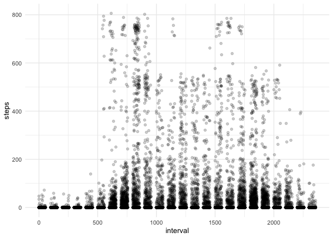
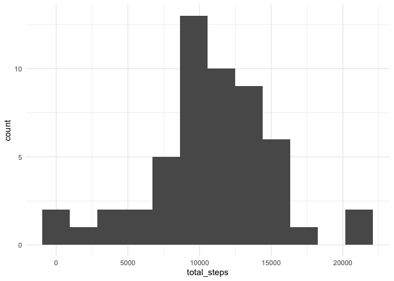
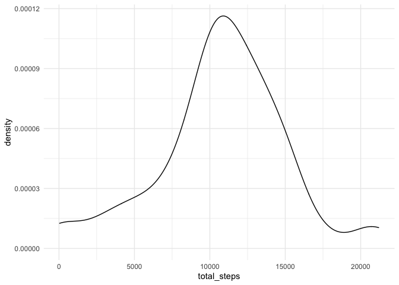
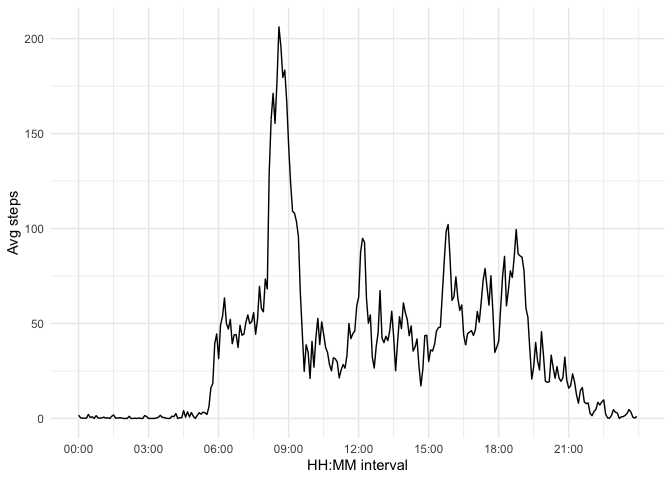
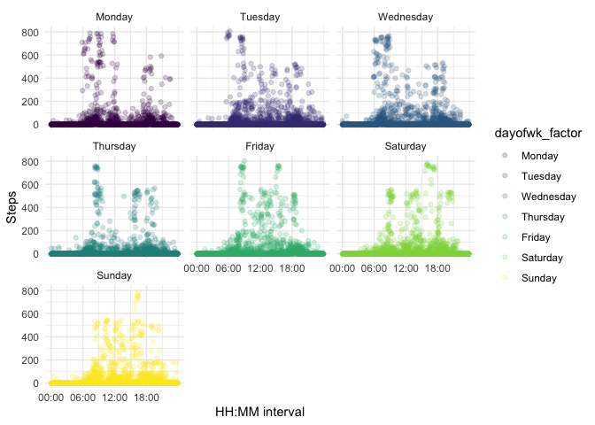
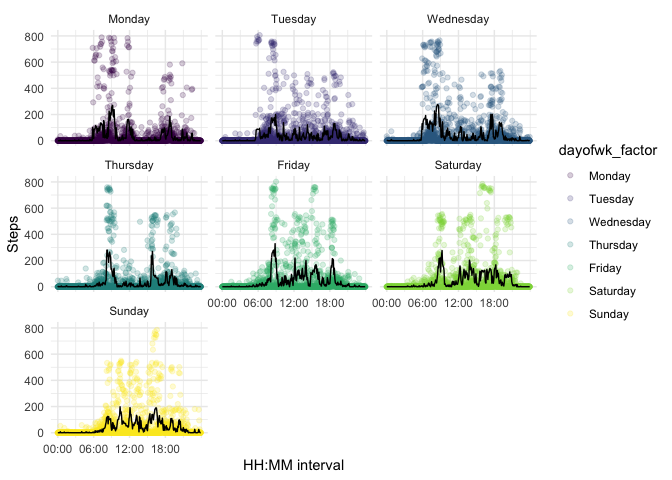
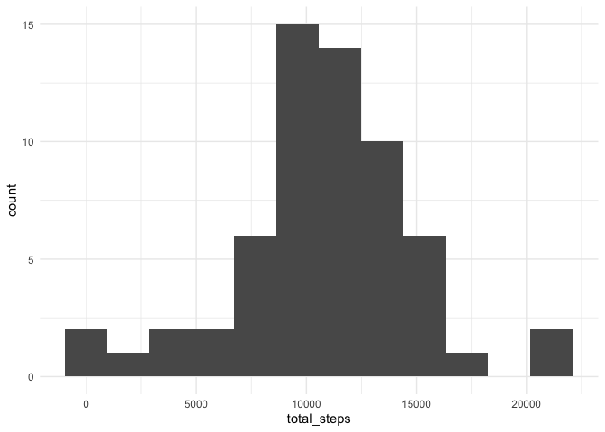
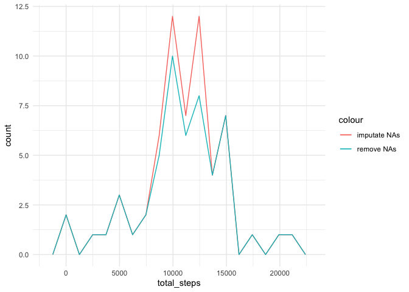
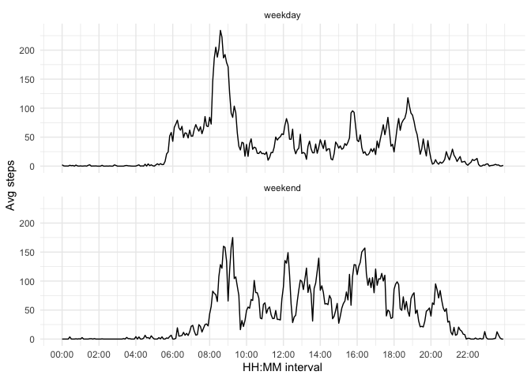

Student: Chad Morgan

May 2021


```r
library(dplyr)
```

```
## 
## Attaching package: 'dplyr'
```

```
## The following objects are masked from 'package:stats':
## 
##     filter, lag
```

```
## The following objects are masked from 'package:base':
## 
##     intersect, setdiff, setequal, union
```

```r
library(stringr)
library(ggplot2)

theme_set(theme_minimal())

options(scipen=6)
```


## Loading and preprocessing the data

### read in raw data from the csv


```r
activity_raw <- read.csv('../activity.csv',stringsAsFactors=FALSE)
```

#### take a quick look at the raw data structure


```r
str(activity_raw)
```

```
## 'data.frame':	17568 obs. of  3 variables:
##  $ steps   : int  NA NA NA NA NA NA NA NA NA NA ...
##  $ date    : chr  "2012-10-01" "2012-10-01" "2012-10-01" "2012-10-01" ...
##  $ interval: int  0 5 10 15 20 25 30 35 40 45 ...
```

*Backtracking*: As I worked ahead on the problem, I noticed gaps when plotting the interval on the x-axis. When I looked at the values more closely, I realized they corresponded to times on the 24-hour system, but stored as integers. 

See plot below to show the gaps after numbers ending in 55 (i.e. the last period of an hour)


```r
ggplot(activity_raw,aes(interval,steps))+
  geom_point(alpha=0.2)
```

```
## Warning: Removed 2304 rows containing missing values (geom_point).
```

<!-- -->

I am backtracking to this point to convert the raw interval field value to a sequence number so we don't have those weird gaps.


```r
interval_values <- unique(activity_raw$interval)
interval_values <- interval_values[order(interval_values)]
interval_sequence_nr <- seq(1:length(interval_values))
interval_mapping <- data.frame(
  'interval' = interval_values,
  'interval_nr'=interval_sequence_nr
)
```


```r
# let's also take some time to convert intveral to a more standard HH:MM looking string
interval_pad <- str_pad(string = interval_values,4,'left','0')
interval_hhmm <- paste(str_sub(interval_pad,1,2),":",str_sub(interval_pad,3,4),sep='')

interval_mapping$interval_hhmm <- interval_hhmm

head(interval_hhmm)
```

```
## [1] "00:00" "00:05" "00:10" "00:15" "00:20" "00:25"
```


### pre-processing at the interval level

- reformat date column from character to date 
- Use weekdays function to add which day of week 
- mark whether the day is a weekday or weekend
- join the interval sequence number


```r
activity_enhanced <- activity_raw %>%
  inner_join(interval_mapping,by = 'interval') %>%
  mutate(
    date = as.Date(date),
    dayofwk = weekdays(date),
    weekend = ifelse(dayofwk %in% c('Sunday','Saturday'),'weekend','weekday'),
    dayofwk_factor = factor(
      dayofwk,
      levels = c('Monday','Tuesday','Wednesday','Thursday','Friday','Saturday','Sunday')
    )
  ) 
```


### make a table aggregated steps over day for later analysis

```r
daily_steps <- activity_enhanced %>%
    group_by(date,dayofwk,dayofwk_factor,weekend) %>%
    summarize(
        total_steps = sum(steps,na.rm = TRUE),
        missing_count = sum(is.na(steps)),
        n_intervals = n()
    ) 
```

```
## `summarise()` regrouping output by 'date', 'dayofwk', 'dayofwk_factor' (override with `.groups` argument)
```


Several days look like they are completely missing, so it might also be helpful to have a data set with just days with
complete observations


```r
complete_days_steps <- daily_steps %>%
  filter(missing_count == 0)
```

### By-interval summary dataset 


```r
interval_steps <- activity_enhanced %>%
  group_by(interval,interval_hhmm,interval_nr) %>%
  summarize(
    total_steps = sum(steps,na.rm = TRUE),
    avg_steps = mean(steps,na.rm=TRUE),
    missing_count = sum(is.na(steps)),
    n_days = n()
  )
```

```
## `summarise()` regrouping output by 'interval', 'interval_hhmm' (override with `.groups` argument)
```

```r
head(interval_steps)
```

```
## # A tibble: 6 x 7
## # Groups:   interval, interval_hhmm [6]
##   interval interval_hhmm interval_nr total_steps avg_steps missing_count n_days
##      <int> <chr>               <int>       <int>     <dbl>         <int>  <int>
## 1        0 00:00                   1          91    1.72               8     61
## 2        5 00:05                   2          18    0.340              8     61
## 3       10 00:10                   3           7    0.132              8     61
## 4       15 00:15                   4           8    0.151              8     61
## 5       20 00:20                   5           4    0.0755             8     61
## 6       25 00:25                   6         111    2.09               8     61
```


## What is mean total number of steps taken per day?


> 1. Make a histogram of the total number of steps taken each day


```r
ggplot(complete_days_steps,aes(total_steps))+
  geom_histogram(bins=12)
```

<!-- -->

Bonus density plot 


```r
ggplot(complete_days_steps,aes(total_steps))+
  geom_density()
```

<!-- -->


> 2. Calculate and report the mean and median total number of steps taken per day


```r
mean_daily_steps = mean(complete_days_steps$total_steps)
median_daily_steps = median(complete_days_steps$total_steps)

mean_daily_steps
```

```
## [1] 10766.19
```

```r
median_daily_steps
```

```
## [1] 10765
```

The mean steps per observed day was 10766.19
The median steps per observed day was 10765

## What is the average daily activity pattern?

> 1. Make a time series plot (i.e. type = "l") of the 5-minute interval (x-axis) and the average number of steps taken, averaged across all days (y-axis)


```r
ggplot(interval_steps,aes(interval_nr,avg_steps))+
  scale_x_continuous(
    breaks=seq(1,288,36),
    labels=subset(interval_mapping,interval_nr %in% seq(1,288,36))$interval_hhmm
    )+
  xlab("HH:MM interval")+ylab("Avg steps")+
  geom_line()
```

<!-- -->


> 2. Which 5-minute interval, on average across all the days in the dataset, contains the maximum number of steps?


```r
max_avg_steps_interval <- interval_steps[
  which(interval_steps$avg_steps == max(interval_steps$avg_steps)),
  c('interval','interval_hhmm')]

max_avg_steps_interval
```

```
## # A tibble: 1 x 2
## # Groups:   interval, interval_hhmm [1]
##   interval interval_hhmm
##      <int> <chr>        
## 1      835 08:35
```


## Imputing missing values

> Note that there are a number of days/intervals where there are missing values (coded as NA). The presence of missing days may introduce bias into some calculations or summaries of the data.

> 1. Calculate and report the total number of missing values in the dataset (i.e. the total number of rows with NAs)


```r
total_missing_values <- sum(is.na(activity_enhanced$steps))

total_missing_values
```

```
## [1] 2304
```


> 2. Devise a strategy for filling in all of the missing values in the dataset. The strategy does not need to be sophisticated. For example, you could use the mean/median for that day, or the mean for that 5-minute interval, etc.

OK. I've already noticed that entire days are missing, not parts of days. Probably this person forgot to put on the pedometer on these missing days 

I want to quickly see if there is any noticeable difference to the interval pattern across days. It might be really busy, but I think I will try to plot all of the data to see if anything is obvious 


```r
ggplot(activity_enhanced,aes(interval_nr,steps))+
  geom_point(aes(color=dayofwk_factor),alpha=0.2)+
  scale_x_continuous(
     breaks=seq(1,288,72),
     labels=subset(interval_mapping,interval_nr %in% seq(1,288,72))$interval_hhmm
     )+
  xlab("HH:MM interval")+ylab("Steps")+
  facet_wrap(~dayofwk_factor)+
  scale_color_viridis_d()
```

```
## Warning: Removed 2304 rows containing missing values (geom_point).
```

<!-- -->

Yes, it definitely looks like the pattern by interval is different depending on the day of week.

Let's use a simple mean by day of week & interval to impute NAs


```r
summary_steps_interval_dayofwk <- activity_enhanced %>%
  group_by(dayofwk_factor,interval_nr) %>%
  summarize(
    median_steps = median(steps,na.rm=TRUE),
    mean_steps = mean(steps,na.rm=TRUE)
  )
```

```
## `summarise()` regrouping output by 'dayofwk_factor' (override with `.groups` argument)
```


```r
ggplot(activity_enhanced,aes(interval_nr,steps))+
  geom_point(alpha=0.2,aes(color=dayofwk_factor))+
  geom_line(data=summary_steps_interval_dayofwk,aes(interval_nr,mean_steps,group=dayofwk_factor))+
   scale_x_continuous(
     breaks=seq(1,288,72),
     labels=subset(interval_mapping,interval_nr %in% seq(1,288,72))$interval_hhmm
     )+
  xlab("HH:MM interval")+ylab("Steps")+
  facet_wrap(~dayofwk_factor)+
  scale_color_viridis_d()
```

```
## Warning: Removed 2304 rows containing missing values (geom_point).
```

<!-- -->


> 3. Create a new dataset that is equal to the original dataset but with the missing data filled in.


```r
activity_imputed <- activity_enhanced %>%
  inner_join(summary_steps_interval_dayofwk,by=c('dayofwk_factor','interval_nr')) %>%
  mutate(steps_imputed = ifelse(is.na(steps),mean_steps,steps)) %>%
  select(steps_imputed,date,interval,interval_nr,dayofwk,weekend)

head(activity_imputed)
```

```
##   steps_imputed       date interval interval_nr dayofwk weekend
## 1      1.428571 2012-10-01        0           1  Monday weekday
## 2      0.000000 2012-10-01        5           2  Monday weekday
## 3      0.000000 2012-10-01       10           3  Monday weekday
## 4      0.000000 2012-10-01       15           4  Monday weekday
## 5      0.000000 2012-10-01       20           5  Monday weekday
## 6      5.000000 2012-10-01       25           6  Monday weekday
```
#### Summarize dataset with imputed missing values to day level


```r
imputed_daily_steps <- activity_imputed %>%
    group_by(date,dayofwk,weekend) %>%
    summarize(
        total_steps = sum(steps_imputed),
        n_intervals = n()
    ) 
```

```
## `summarise()` regrouping output by 'date', 'dayofwk' (override with `.groups` argument)
```

```r
head(imputed_daily_steps)
```

```
## # A tibble: 6 x 5
## # Groups:   date, dayofwk [6]
##   date       dayofwk   weekend total_steps n_intervals
##   <date>     <chr>     <chr>         <dbl>       <int>
## 1 2012-10-01 Monday    weekday       9975.         288
## 2 2012-10-02 Tuesday   weekday        126          288
## 3 2012-10-03 Wednesday weekday      11352          288
## 4 2012-10-04 Thursday  weekday      12116          288
## 5 2012-10-05 Friday    weekday      13294          288
## 6 2012-10-06 Saturday  weekend      15420          288
```

> 4. Make a histogram of the total number of steps taken each day


```r
ggplot(imputed_daily_steps,aes(total_steps))+
  geom_histogram(bins=12)
```

<!-- -->


#### Compare the distributions directly


```r
ggplot(imputed_daily_steps,aes(total_steps))+
  geom_freqpoly(aes(color='imputate NAs'),bins=18)+
  geom_freqpoly(data=complete_days_steps,aes(total_steps,color='remove NAs'),bins=18)
```

<!-- -->

> Calculate and report the mean and median total number of steps taken per day.


```r
complete_days_steps$na_handling = "remove NAs"
imputed_daily_steps$na_handling = "impute NAs"

compare_na_handling <- complete_days_steps %>%
  select(na_handling,date,dayofwk,weekend,total_steps,n_intervals) %>%
  bind_rows(imputed_daily_steps) %>% 
  group_by(na_handling) %>%
  summarize(
    mean_steps = mean(total_steps),
    median_steps = median(total_steps)
  )
```

```
## Adding missing grouping variables: `dayofwk_factor`
```

```
## `summarise()` ungrouping output (override with `.groups` argument)
```

```r
compare_na_handling
```

```
## # A tibble: 2 x 3
##   na_handling mean_steps median_steps
##   <chr>            <dbl>        <dbl>
## 1 impute NAs      10821.        11015
## 2 remove NAs      10766.        10765
```


> Do these values differ from the estimates from the first part of the assignment? What is the impact of imputing missing data on the estimates of the total daily number of steps?

Yes, we can see that both the median and mean are higher when calculated with missing values imputed.

## Are there differences in activity patterns between weekdays and weekends?


```r
weekday_interval_steps <- activity_enhanced %>%
  group_by(weekend,interval,interval_hhmm,interval_nr) %>%
  summarize(
    total_steps = sum(steps,na.rm = TRUE),
    avg_steps = mean(steps,na.rm=TRUE),
    missing_count = sum(is.na(steps)),
    n_days = n()
  )
```

```
## `summarise()` regrouping output by 'weekend', 'interval', 'interval_hhmm' (override with `.groups` argument)
```


> Make a panel plot containing a time series plot (i.e. type = "l") of the 5-minute interval (x-axis) and the average number of steps taken, averaged across all weekday days or weekend days (y-axis).


```r
ggplot(weekday_interval_steps,aes(interval_nr,avg_steps))+
  geom_line()+
  scale_x_continuous(
    breaks=seq(1,288,24),
    labels=subset(interval_mapping,interval_nr %in% seq(1,288,24))$interval_hhmm
    )+
  xlab("HH:MM interval")+ylab("Avg steps")+
  facet_wrap(~weekend,nrow=2)
```

<!-- -->

From our panel plot, we can see that the pattern is much different between weekdays and weekends. 

On weekdays this person seems to be awake and taking steps before 6am, and we see a big peak in steps from 8am to 9am, possibly on a morning walk routine or a commute. After that peak, the average steps tends to be somewhat lower with smaller peaks around noon, 4pm, and 7pm. They seem to have mostly settled down by around 7:30pm.

On weekends their morning routine seems to be less consistent, but the first step peak starts later, between 8am and 9:30 or so, indicating that this person is waking up later on weekends. Overall, steps through the daytime are higher than the weekday average. We can also see that this person seems to be up and moving later in the evening compared to weekdays, with the average steps not settling down until around 9pm.

